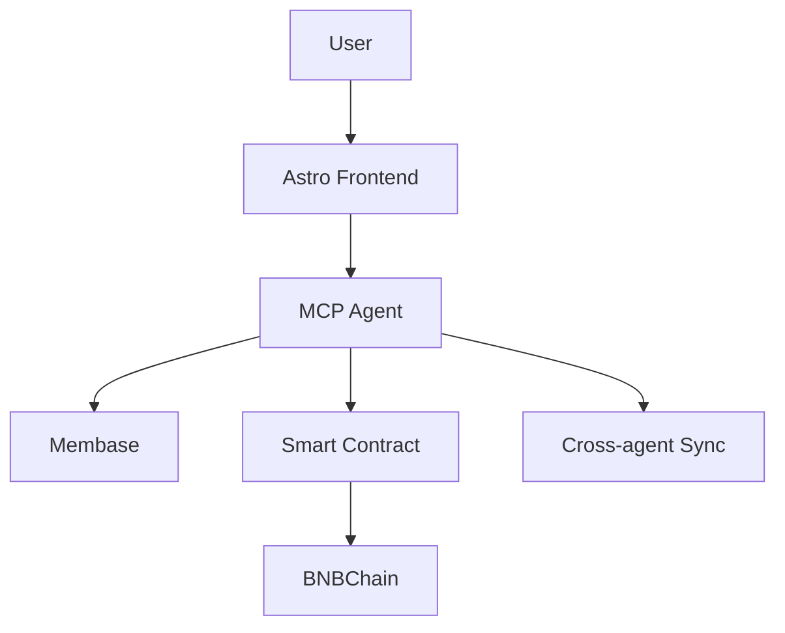
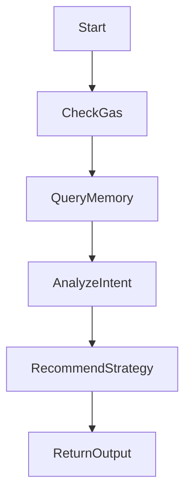

# 🧠 AION – Immortal AI Agent on BNBChain

## 🌍 Overview

AION is a decentralized, on-chain **AI agent** built on **BNBChain**, designed to autonomously manage DeFi strategies using AI intelligence, sovereign memory via **Membase**, and cross-platform interaction through **BitAgent**.

Built for the $500,000 Unibase Hackathon, AION addresses inefficiencies in DeFi strategy management by creating an immortal AI entity that learns, adapts, and shares knowledge across the Web3 ecosystem.

---

## 🚨 Problem

DeFi protocols are:
- Fragmented across chains
- Difficult to manage for non-technical users
- Inefficient in capturing yield opportunities

Additionally, **AI agents today lack:**
- Decentralized memory
- On-chain autonomy
- Interoperability across platforms

---

## ✅ Solution: AION

AION is:
- 🧠 An **on-chain AI agent** powered by BitAgent
- 🧬 Uses **Membase** to store and evolve memory
- ⚡ Reacts to DeFi conditions and recommends actions
- 🤝 Shares knowledge across AI agents (cross-agent sync)

---

## 💡 Key Features

- **Autonomous AI Agent**
- **Decentralized Memory (Membase)**
- **Cross-platform Communication (MCP/BitAgent)**
- **DeFi Vault Interaction**
- **Custom Strategy Recommendations**
- **Gas Optimization**
- **Natural Language API**

---

## 📂 Folder Structure

```
AION/
├── frontend/        # Astro + Bun interface
├── contracts/       # Foundry smart contracts
├── mcp_agent/       # Express-based MCP agent
├── docs/            # Flowcharts and technical breakdowns
```

---

## ⚙️ Smart Contracts Used

### `AIONVault.sol`
- Handles native token deposits and withdrawals
- Emits events: `Deposited`, `Withdrawn`
- Interfaces with the AI agent for tracking and decision-making

### Planned Contracts:
- `VaultManager.sol`: Multi-vault coordinator for AI
- `StrategyRegistry.sol`: Stores all strategies AI can choose from
- `AIONRouter.sol`: For future integration with LayerZero or Wormhole

---

## 🛠 Architecture

### 📡 Technical Flowchart (Overview)



### 🧠 Internal AI Logic Flow



### 📊 Frontend Interaction Flow

```mermaid
flowchart TD
  User --> Click[Launch Agent Button]
  Click --> API[/recommend-time]
  API --> Agent --> AIResponse --> Frontend
```

---

## 🚀 Setup Instructions

### Frontend (Astro + Bun)
```bash
cd frontend
bun install
bun dev
```

### MCP Agent (Node.js + Express)
```bash
cd mcp_agent
npm install
node index.js
```

### Smart Contracts (Foundry)
```bash
cd contracts
forge build
forge test -vvvv
```

---

## 🎯 Submission Alignment

| Requirement                               | Implemented? |
|-------------------------------------------|--------------|
| On-Chain AI Agent                         | ✅            |
| Decentralized Memory (Membase)            | ✅ (planned)  |
| Cross-Platform Interoperability           | ✅ (via BitAgent/MCP) |
| Working Prototype / Demo                  | ✅            |
| Source Code on GitHub                     | ✅            |
| Testing + Deployment Instructions         | ✅            |
| Documentation + Flowcharts                | ✅            |

---

## 🎬 Demo Video (To be added)

---

## 🧾 License

MIT © 2025 Samar Abdelhameed